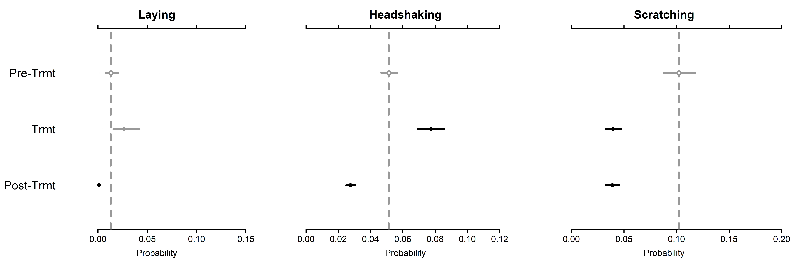

```{r setup, include=FALSE}
knitr::opts_chunk$set(echo = TRUE)
```

# Multinomial Regression
  >Comments/Questions: Contact Grant Connette (grmcco@gmail.com) and Jared Stabach (stabachj@si.edu)
  
Script investigates behavioral changes observed in scimitar-horned oryx fit with GPS collars and described in Stabach et al. 2019.  Data fit in a Bayesian framework, estimating the probability of each behavioral activity and based on a multinomial likelihood. Each animal was used as their own control to assess how each behavior changed across time periods. Our expectation was that adverse behaviors, such as headshaking, should increase during the period immediately after animals were collared (treatment) and return to normal activity during the post-treatment periods when animals become acclimated or adjust to the device.

The steps described here are aimed and recreating the figures and tables listed in Stabach et al. 2019.  Importantly, this includes Figure 1.  



Additional details in:

Stabach, J.A., Cunningham, S.A., Connette, C., Mota, J.L., Reed, D., Byron, M., Songer, M., T. Wacher, Mertes, K., Brown, J.L., Comizzoli, P., Newby, J., S. Monfort, and P. Leimgruber. In Review. Short-term Effects of GPS Collars on Scimitar-horned Oryx. Journal of Wildilfe Management.

### Load Libraries
Load each library necessary to complete the analysis.

```{r Load, eval = T, message = F}
# Clear objects in memory
rm(list=ls())

# Load necessary libraries
library(tidyr)
library(reshape2)
library(ggplot2)
library(jagsUI)
library(MCMCvis)
library(HDInterval)
```

### Read/Prepare Data
Read the dataframe into [R](https://cran.r-project.org/) and correct the datatypes for some of the variables (`as.POSIXct()` and `as.factor()`).  Remove the 'Control' animals from the dataframe since the sample size was so low from this subset.  Collared animals serve as their own control, since pre-treatment information was collected.

```{r Read, eval = T}
# Read in file
bdata <- read.csv("./Data/bdata.csv", header=T, sep=",", row.names=1)

# View data
head(bdata)

# Set/Update the data/time fields
bdata$TimeStart <- as.POSIXct(bdata$TimeStart, format="%Y-%m-%d %H:%M")
bdata$TimeEnd <- as.POSIXct(bdata$TimeEnd, format="%Y-%m-%d %H:%M")

# Code the Control and Treatment records
# Remove the Controls, too few animals to be useful
# Code the Control and Treatment records.
bdata$Control <- ifelse(bdata$Treatment == "control",1,2) 
bdata.control <- bdata[which(bdata$Treatment == "control"),]
bdata <- bdata[which(bdata$Treatment != "control"),]

# Set AdjObTime as a factor 
bdata$AdjObTime <- as.factor(bdata$AdjObTime)
```

### Format for JAGS
Prepare data to be ingested into JAGS.  Note, the number of iterations ('n.iter') has been reduced (e.g., 10,000) so that analyses will execute quickly.  `n.iter` should be increased in subsequent analyses to make sure the parameter space has been thoroughly explored. 

```{r JAGS, eval = T, message = F}
# Set-up burn-in/iterations for JAGS
n.iter=10000 # Number of iterations.  
n.burnin=n.iter*0.20 # burn-in iterations (0.20 percent)
n.thin = 100

# Set up blank list
data.list <- vector("list")

y <- cbind(bdata$HU,bdata$HD,bdata$LAY,bdata$HDSK,bdata$LOCO,bdata$SCRATCH) 
#class(y) To make sure apended to matrix

# Create matrix for inverse Wishart prior on individual random effects
R <- matrix(0,nrow=6,ncol=6)
for (i in 1:6){
  R[i,i] <- 0.1
}

# Setup the data list
data.list=list(
  Y = y, 
  n.outcomes = ncol(y),
  PERIOD = as.numeric(bdata$AdjObTime),
  N = apply(y,1,sum),
  n = nrow(y),
  ind = as.numeric(droplevels(bdata$Animal)),
  nind = length(unique(bdata$Animal)),
  R = R
)
```

### Model Description
Create a multinomial model to compare changes in behavior across treatment periods.  Because multiple individuals are included, model parametization includes random effect.  We set the first behavior (Standing head-up) as our reference behavior.  Model is saved as `Model_Multinomial_withREs.R` and sourced in the `jags` function below. 

```{r Model, eval = F}
model{
  
  # SPECIFY THE PRIORS FOR GLOABAL PARAMETERS
  # ***********************************
  # Alphas represent the intercept for relative probabilities of each outcome at the pre-treatment period on the log scale
  # Fix the relative probability of the reference outcome (HU) to zero on the log scale
  alpha[1] <- 0  
  
  # Loop over response outcomes
  for (j in 2:n.outcomes) {   
    # Assign diffuse priors to the relative probabilities of all outcomes except the reference (for period 1)
    alpha[j] ~ dnorm(0, 0.001)  
  }
  
  # Betas represent change from period one on the log scale
  # Loop over response outcomes
  for (j in 1:n.outcomes){
    # beta[1,] are fixed to zero because there is no period-adjustment needed for period 1 since it is the reference
    beta[1, j] <- 0   
  }
  
  # Loop over time periods 2 (treatment) and 3 (post-treatment)
  for (i in 2:3) { 
    # As for period 1, we have to fix the relative probabilities of the reference outcome (HU) to zero on the log scale
    beta[i, 1] <- 0
    # Loop over response outcomes
    for (j in 2:n.outcomes){
      # Assign diffuse priors to change (periods 1-2 and periods 1-3) in rel. probs. of outcomes
      beta[i, j] ~ dnorm(0, 0.001)   
      } 
  }
  
  # tau.j parameters represent inter-individual variation in relative probs. of outcomes
  # Loop over response outcomes
  for (j in 1:n.outcomes){  
    # Mean of individual random effects is 0
    mu.re[j] <- 0           
  }
  
  # PRIORS FOR ELEMENTS OF PRECISION MATRIX
  # ***********************************
  # df set to j+1
  prec[1:6,1:6] ~ dwish(R[,],7)  
  # Convert precision to covariance matrix
  sigma[1:6,1:6] <- inverse(prec[,])   
  # Correlation between outcome 1 and 2
  # rho <- sigma[1,2]/sqrt(sigma[1,1]*sigma[2,2])  
  
  # DEFINE INDIVIDUAL-LEVEL PARAMETERS
  # ***********************************
  # Loop over individuals to define individual-level random effects
  for (idx in 1:nind){  
    # Rel. prob. of reference outcome fixed to zero, so there is no adjustment among indiviuals
    eps[idx,1:6] ~ dmnorm(mu.re[], prec[,])      
  }
  
  # LIKELIHOOD 
  # ***********************************
  # Loop over observations
  for (i in 1:n) {     
    # Multinomial response
    Y[i, ] ~ dmulti(p[i, ] , N[i])

    # Loop through outcomes
    for (j in 1:n.outcomes) {     
      p[i,j] <- phi[i,j] / sum(phi[i, ])
      log(phi[i,j]) <- alpha[j] + beta[PERIOD[i], j] + eps[ind[i], j]
    }
  }
  
  # DERIVED QUANTITIES
  # ***********************************
  for (j in 1:n.outcomes){
    PROBS[1,j] <- PHI[1,j] / sum(PHI[1,])
    log(PHI[1,j]) <- alpha[j] + beta[1,j]
    PROBS[2,j] <- PHI[2,j] / sum(PHI[2,])
    log(PHI[2,j]) <- alpha[j] + beta[2,j]
    PROBS[3,j] <- PHI[3,j] / sum(PHI[3,])
    log(PHI[3,j]) <- alpha[j] + beta[3,j]
  }
}
```

### Fitting JAGS Model
Here we fit the model described above, specifying the parameters estimated to save in the output.

```{r Fit, eval=F, warning=F}
jm2=jags(model.file = "Model_Multinomial_withREs.R",
         data=data.list,
         n.chains=3,n.iter=n.iter,n.burnin = n.burnin,n.thin=n.thin,parallel = F,
         parameters.to.save = c("alpha","beta","sigma","PROBS","eps"))

# You will receive an error that "At least one Rhat value could not be calculated."  This is expected since these values were pre-set to zero (0) in our model above.
```

### Load Saved Model
Since running the model can take a lot of time, you can save the model as a `.Rda` file and load the model output from disk.  The resulting object can then be loaded into [R](https://cran.r-project.org/) without going through all the steps to fit the model and prepare the dataframe.

```{r Save, eval=T}
# Save JAGS model
#save(jm2, file = "Behavior_Models.Rda")
load("Behavior_Models.Rda")

# Summarize object
jm2
```

### Summarize Results
Summarize and view the parameters estimated by the model, calculating the highest posterior density intervals. Plot the probabilities of each behavior to assess model convergence.  Important in examining the results is keeping track of each parameter, as the parameters are annotated in the output matrix and dependent on the order in which they were input. 

```{r Summary, eval=T}
# eps are the individual random effects
# tau.j's are the random effects for each behavior

# Investigate values in output
jm2$mean

# Look at trace and density plots to assess model convergence
MCMCtrace(jm2, params = 'PROBS', ind=TRUE, pdf=FALSE)

# Summarize values from the output, include median and highest posterior density intervals
Post.Summary <- MCMCsummary(jm2, 
                            params = 'PROBS',
                            Rhat = TRUE,
                            n.eff = TRUE,
                            func = function(x) c(median(x), hdi(x,credMass = 0.95)),
                            func_name = c('median','hdi_low','hdi_high'))

# View
Post.Summary
```

### Export Summary
Output `Post.Summary` to re-create Appendix A.  

```{r Export, eval=F}
# Export file
write.csv(Post.Summary, "./Output/jm2_Output_Summary.csv")
```

### Plot Results
Using the `MCMCplot` function, plot the probabilities of the behaviors with significant effects from the pre-treatment period.  Again, here, it is important to keep track of the parameters output from the model.  Note that the reference category (pre-treatment period) has been set to '0'.  Thus, treatment and post-treatment periods are the probability of behavior in reference to this pre-treatment period.  This allowed us to evaluate the general effect of each behavior.  The code could be easily modified to plot all variables estimated.  To save this plot to a directory, the command `png()` and `dev.off()` can be activated in the code.

```{r Plot, eval = T}
# Plot the caterpillar plots from the MCMC output
#MCMCplot(jm2, params = 'PROBS')

# Set all the Labels
main.label <- c("Head-Up", "Head-Down", "Laying", "Headshaking", "Locomotion", "Scratching")

# Display only the graphs where a significant change occurred
#png(file = "./Output/PROBS_variables.png",width=15, height=5, units = 'in', res=500)
layout(matrix(c(1,2,3), 1, 3, byrow = FALSE), widths=1, heights=1)

MCMCplot(jm2, params = c('PROBS\\[1,3\\]', 'PROBS\\[2,3\\]', 'PROBS\\[3,3\\]'), ref = Post.Summary[7,8], 
         ref_ovl = TRUE, ISB=FALSE, 
         main=main.label[3],
         med_sz=1.5, thin_sz = 1, thick_sz = 3, ax_sz=2, main_text_sz=2,axis_text_sz=1.5,tick_text_sz = 1.5, 
         labels_sz = 2,
         labels=c('Pre-Trmt','Trmt','Post-Trmt'), xlab="Probability",
         mar = c(5.1, 6.1, 4.1, 2.1))
MCMCplot(jm2, params = c('PROBS\\[1,4\\]', 'PROBS\\[2,4\\]', 'PROBS\\[3,4\\]'), ref = Post.Summary[10,8], 
         ref_ovl = TRUE, ISB=FALSE, 
         main=main.label[4],
         med_sz=1.5, thin_sz = 1, thick_sz = 3, ax_sz=2, main_text_sz=2,axis_text_sz=1.5,tick_text_sz = 1.5, 
         labels=NULL, xlab="Probability",
         mar = c(5.1, 6.1, 4.1, 2.1))
MCMCplot(jm2, params = c('PROBS\\[1,6\\]', 'PROBS\\[2,6\\]', 'PROBS\\[3,6\\]'), ref = Post.Summary[16,8], 
         ref_ovl = TRUE, ISB=FALSE, 
         main=main.label[6],
         med_sz=1.5, thin_sz = 1, thick_sz = 3, ax_sz=2, main_text_sz=2,axis_text_sz=1.5,tick_text_sz = 1.5, 
         labels=NULL, xlab="Probability")
#dev.off()
```